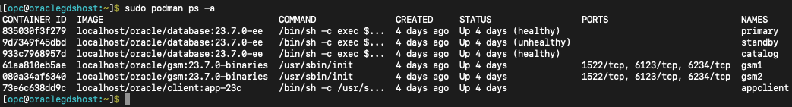

# Initialize Environment

## Introduction

In this lab we will review and startup all components required to successfully run this workshop.

*Estimated Lab Time:* 10 Minutes.

### Objectives
- Initialize the workshop environment.

### Prerequisites
This lab assumes you have:
- A Free Tier, Paid or LiveLabs Oracle Cloud account
- You have completed:
    - Lab: Prepare Setup (*Free-tier* and *Paid Tenants* only)
    - Lab: Environment Setup

## Task 1: Validate That Required Processes are Up and Running.
1. Now with access to your remote desktop session, proceed as indicated below to validate your environment before you start executing the subsequent labs. The following Processes should be up and running:

    - Oracle GSM1 Container
    - Oracle GSM2 Container
    - Oracle Catalog Primary Database container
    - Oracle Application Primary Database container
    - Oracle Application StandBy Database container
    - Appclient Container

2.  Open a terminal session and proceed as indicated below to validate the services.

    - Oracle GDS LiveLab's Podman container Details

        ```
        <copy>
        sudo podman ps -a
        </copy>
        ```
        

    - If a container is stopped and not in running state then try to restart it by using below docker command.

        ```
        <copy>
        sudo podman stop <container ID/NAME>
        </copy>
        <copy>
        sudo podman start <container ID/NAME>
        </copy>
        ```
    - For multiple containers, run the following to restart all at once:

        ```
        <copy>
        sudo podman container stop $(sudo podman container list -qa)
        </copy>
        <copy>
        sudo podman container start $(sudo podman container list -qa)
        </copy>
        ```

You may now **proceed to the next lab**


