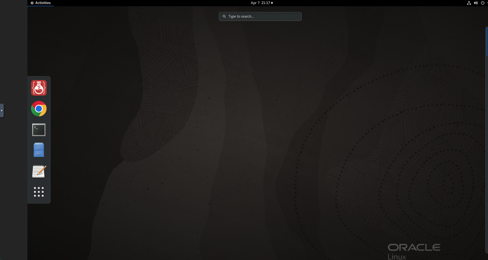
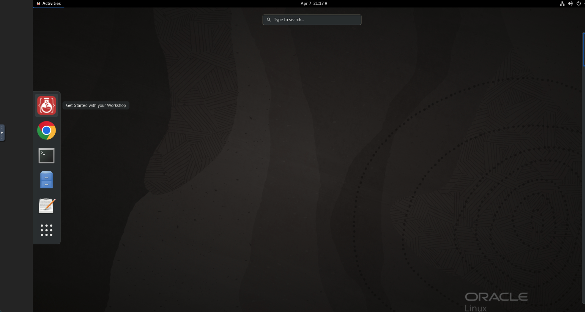
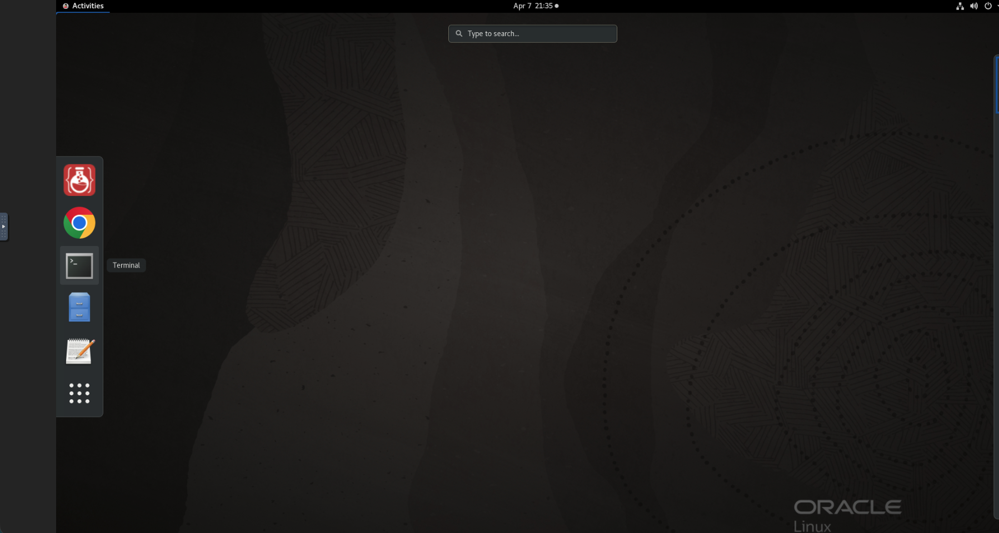
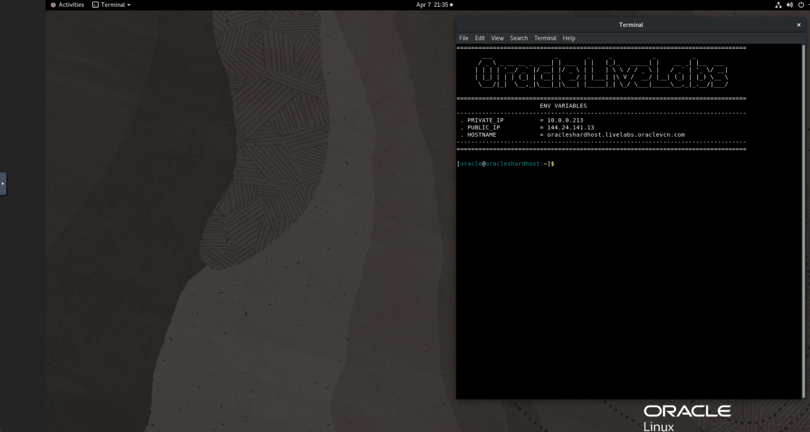
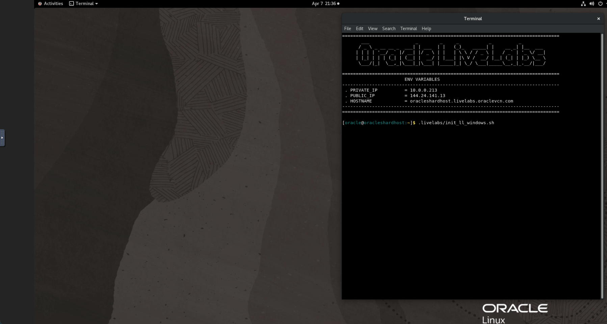
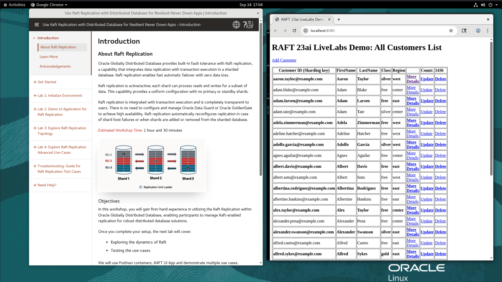
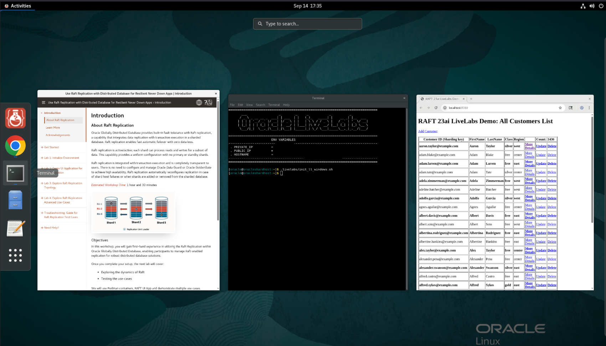
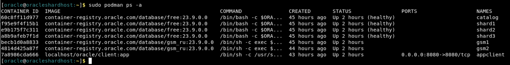

# Initialize Environment

## Introduction

In this lab we will review and startup all components required to successfully run this workshop.

*Estimated Lab Time:* 10 Minutes.

### Objectives
- Verify and Initialize the workshop environment at any time.

### Prerequisites
This lab assumes you have:
- A Free Tier, Paid or LiveLabs Oracle Cloud account
- You have completed:
    - Lab: Prepare Setup (*Free-tier* and *Paid Tenants* only)
    - Lab: Environment Setup (*Free-tier* and *Paid Tenants* only)
    - Lab: Get started (*Login to the LiveLabs Sandbox Environment* only)

## Task 1: Get started with your workshop.
1. From the top left corner within the liveLabs browser session, click on "Activities". It will show widgets list in vertical order.

   

2. From the widgets list, click on the first widget which shows the hoverover text on the right as  "Get Started with your Workshop"

   

 3. Instead of above 2nd step, an alternate option to Get started with your workshop or re-initialize environment at any time:
   Click on Activities (shown on top left corner) >> Terminal icon (shown on the bottom of the screen which is next to Chrome icon) to Launch the Terminal.

   

    Open terminal by click on Terminal icon: 

    

    Initialize livelab from terminal by copy and past below 

    ```
    <copy>
    .livelabs/init_ll_windows.sh
    </copy>
    ```
    
    It will show like this:

    
     
    After pressing enter or return button from your machine, it will show two windows and terminal goes behind 2nd window. 

## Task 2: Verify two browser windows after initialize environment.

1. Two browser windows are shown after initialize environment. On the left, "Introduction" About Raft Replication and on the right, "Raft Replication LiveLabs Demo: All Customers List" like below:

    

2. When you click on "Activities" again from the left top corner it will show two browser windows and terminal:


    

If both browser windows are not shown for some reason, reload the browser windows at anytime with steps as in above Task1.

## Task 2: Validate That Required Processes are Up and Running from a terminal window.
1. Now with access to your remote desktop session, proceed as indicated below to validate your environment before you start executing the subsequent labs. The following Processes should be up and running:

    - Oracle Sharding GSM1 Container
    - Oracle Sharding GSM2 Container
    - Oracle Sharding Catalog container
    - Three Oracle shard Database containers
    - Appclient Container

2. Click on Activities (shown on top left) >> Terminal icon (shown on center of the screen which is next to Chrome icon) to Launch the Terminal when it is not already opened. Proceed as indicated below to validate the services.

    - Oracle Sharding container Details

        ```
        <copy>
        sudo podman ps -a
        </copy>
        ```
        

    - If a container is stopped and not in running state then try to restart it by using podman command.

        ```
        <copy>
        sudo podman stop <container ID/NAME>
        </copy>
        <copy>
        sudo podman start <container ID/NAME>
        </copy>
        ```
    - For multiple containers, run the following to restart all at once when needed:

        ```
        <copy>
        sudo podman container stop $(sudo podman container list -qa)
        </copy>
        <copy>
        sudo podman container start $(sudo podman container list -qa)
        </copy>
        ```

You may now proceed to the next lab.

## Acknowledgements
* **Authors** - Deeksha Sehgal, Ajay Joshi, Oracle Globally Distributed Database, Product Management
* **Contributors** - Pankaj Chandiramani, Shefali Bhargava, Param Saini, Jyoti Verma
* **Last Updated By/Date** - Ajay Joshi, Oracle Globally Distributed Database, Product Management, March 2026
